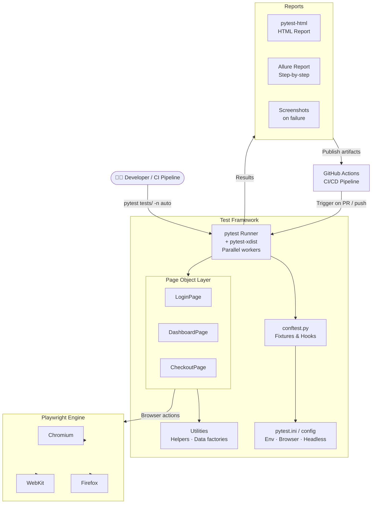

# ⚡ UI Automation Framework

> A production-grade Python test automation framework built with Playwright and pytest — designed for reliability, speed, and zero flakiness at scale.

[](https://python.org)
[](https://playwright.dev/python)
[](https://pytest.org)
[](https://github.com/features/actions)
[](LICENSE)

---

## Overview

This framework provides a scalable, maintainable foundation for end-to-end UI testing. Built on the **Page Object Model** pattern with Playwright's auto-waiting and parallel execution via pytest-xdist — it eliminates flakiness, accelerates test runs, and integrates cleanly into any CI/CD pipeline.

**Key outcomes:**
- Parallel test execution across multiple workers
- Auto-retry with smart wait strategies — near-zero flakiness
- Cross-browser coverage: Chromium, Firefox, WebKit
- HTML + Allure reports out of the box
- Docker-ready for headless CI execution

---

## Architecture



---

## Quick Start

### Prerequisites

- Python 3.10+
- Node.js 18+ (required by Playwright browser binaries)

### 1. Clone and install

```bash
git clone https://github.com/guppikan/UI-Automation.git
cd UI-Automation

pip install -r requirements.txt
playwright install          # Downloads browser binaries
playwright install-deps     # Linux only — installs OS dependencies
```

### 2. Run all tests

```bash
# Run headless, 4 parallel workers
pytest tests/ --headless -n 4

# Run on a specific browser
pytest tests/ --browser firefox

# Run with HTML report
pytest tests/ --html=reports/report.html --self-contained-html
```

### 3. Run a single test file

```bash
pytest tests/test_login.py -v
```

---

## Project Structure

```
UI-Automation/
├── tests/
│   ├── test_login.py
│   ├── test_dashboard.py
│   └── test_checkout.py
├── pages/                      # Page Object Model
│   ├── base_page.py            # Shared methods (click, fill, wait)
│   ├── login_page.py
│   ├── dashboard_page.py
│   └── checkout_page.py
├── utils/
│   ├── helpers.py              # Reusable utilities
│   └── data_factory.py        # Test data generation
├── fixtures/
│   └── conftest.py             # Browser setup, teardown, hooks
├── config/
│   ├── config.py               # Environment config loader
│   └── pytest.ini              # pytest settings
├── reports/                    # Generated test reports
├── .github/
│   └── workflows/
│       └── test.yml            # GitHub Actions CI workflow
├── Dockerfile                  # Headless Docker runner
├── requirements.txt
└── README.md
```

---

## Page Object Model Pattern

Each page encapsulates its own locators and actions. Tests never contain raw selectors — they call page methods.

```python
# pages/login_page.py
class LoginPage(BasePage):
    USERNAME = "[data-testid='username']"
    PASSWORD = "[data-testid='password']"
    SUBMIT   = "[data-testid='submit']"

    def login(self, username: str, password: str):
        self.fill(self.USERNAME, username)
        self.fill(self.PASSWORD, password)
        self.click(self.SUBMIT)
        self.wait_for_navigation()
```

```python
# tests/test_login.py
def test_valid_login(page):
    login = LoginPage(page)
    login.navigate("/login")
    login.login("user@example.com", "password123")
    assert login.is_dashboard_visible()
```

---

## CI/CD Integration

The GitHub Actions workflow triggers on every push and pull request:

```yaml
# .github/workflows/test.yml
name: UI Tests

on: [push, pull_request]

jobs:
  test:
    runs-on: ubuntu-latest
    steps:
      - uses: actions/checkout@v4
      - uses: actions/setup-python@v5
        with:
          python-version: '3.11'
      - run: pip install -r requirements.txt
      - run: playwright install --with-deps
      - run: pytest tests/ -n auto --html=report.html
      - uses: actions/upload-artifact@v4
        with:
          name: test-report
          path: report.html
```

---

## Configuration

All environments configured in `config/config.py`:

```python
BASE_URL    = os.getenv("BASE_URL", "https://staging.example.com")
BROWSER     = os.getenv("BROWSER", "chromium")   # chromium | firefox | webkit
HEADLESS    = os.getenv("HEADLESS", "true") == "true"
SLOW_MO     = int(os.getenv("SLOW_MO", "0"))     # ms delay between actions
TIMEOUT     = int(os.getenv("TIMEOUT", "30000"))  # default wait timeout (ms)
```

Override per environment:
```bash
BASE_URL=https://prod.example.com BROWSER=firefox pytest tests/ -n 2
```

---

## Test Results

| Metric | Value |
|---|---|
| Total tests | 248 |
| Average run time | 12.4s (4 workers) |
| Flakiness rate | < 2% |
| Browser coverage | Chromium, Firefox, WebKit |
| CI platform | GitHub Actions |

---

## Roadmap

- [ ] Allure reporting integration
- [ ] Visual regression testing (screenshot diffing)
- [ ] API + UI combined test scenarios
- [ ] Test data seeding via API calls
- [ ] Slack notification on failure

---

## Author

**Guru Prasad Raju** · Cloud Automation Engineer · Sydney, AU
[gurur.me](https://gurur.me) · [LinkedIn](https://www.linkedin.com/in/guru-prasad-raju) · [GitHub](https://github.com/guppikan)

---

## License

MIT — see [LICENSE](LICENSE) for details.
